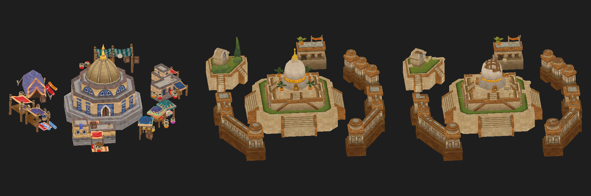

# civ6-blp-exporter

Export 3D models, textures and animations from Civilization VI `.blp` files to OBJ / glTF / PNG.

One command exports every model it can read: city and hero buildings, tile bases, wonders, units, with their materials and textures, plus "assembly" nodes (e.g. the full Trading Dome / Mahavihara tile with all parts placed). Skinned unit models are written as glTF with skeleton, skin and (optionally) animations.



*Assemblies exported from the Babylon DLC and rendered with `obj_raster.py`: the Trading Dome tile (left) and the Mahavihara tile in two states (right).*

*Unofficial fan tool, not affiliated with or endorsed by Firaxis Games or 2K. This repository contains no game files; the tool only reads your own installation.*

## What you need
- **Civ6 installed** (Steam or Epic). The BLPs hold geometry, but the texture pixels are separate files in the game folder; the tool finds the install itself (or use `--game` / `CIV6_DIR`).
- **Python 3.9+** and two packages: `pip install -r requirements.txt` (numpy, Pillow). No game mods, no admin rights, the game doesn't need to be running. It only *reads* your game files.
- **Tested on:** Windows, Steam, Babylon DLC BLPs (Windows platform files). Other platforms and DLCs may need tweaks (see limits).

## Use
```
python civ6_blp_export.py Babylon                  # every BLP in DLC\Babylon
python civ6_blp_export.py Base Babylon -o out      # several packages ("Base" = base game)
python civ6_blp_export.py "C:\...\landmarks\city_buildings.blp"     # one file (or a folder of .blp)
python civ6_blp_export.py Babylon --list           # just list what's inside
```
Options: `--anim NAME...` (animations into skinned glTF), `--max-anims N`, `-o <folder>` (default `civ6_export`), `--states Worked,Pillaged,...`, `--validate`, `--no-textures`, `--game "<install folder>"`, `--platform Windows`.

Models contain the geometry of every tile state together (Construction, Worked, Pillaged... overlap, as in the game files). `--states Worked` instead writes one clean `<name>__Worked.obj/.gltf` per model holding only the groups visible in that state (and sets the assembly states too); state info stays in the object names and glTF `extras.states`. `--validate` checks the finished export (see below).

Output: `<out>/<package>__<blp>/{models,assemblies,textures}/` — `.obj` + `.mtl` (+ `.json` with the mesh/bone/state/material data), shared decoded `textures/*.png`, and `summary.md` / `summary.json`.
Object names inside an OBJ look like `Palgum_bld__g5_Unworked+Worked_mat0`: bone/mesh name (`meshN` when the mesh has no bone name), group, the tile states in which that group is visible, material. Each object is preceded by the matching `usemtl`, and the OBJ declares its `.mtl` with `mtllib`, so Blender imports the materials.
Open the `.gltf` files (recommended: materials come through as PBR) or the OBJs in Blender (OBJ is Z-up) or any glTF viewer, MeshLab, etc. `python obj_raster.py model.obj out.png` makes a quick textured preview.

## Files
| File | Purpose |
|---|---|
| `civ6_blp_export.py` | the command-line entry point |
| `blp_reader.py` | container: type info, allocation table, pointer walker |
| `blp_models.py` | models, materials, vertex decode, OBJ output |
| `blp_textures.py` | BC1 / BC3 / BC4 / BC5 texture decode |
| `blp_assemble.py` | skeleton-only placement nodes (assemblies) |
| `blp_gltf.py` | glTF with skeleton, skinning and animations |
| `blp_anim.py` | loose `ANIMATION_*` file decoder |
| `obj_raster.py` | quick textured preview renderer |
| `blp_validate.py` | export consistency check (`--validate`, or `python blp_validate.py <folder>`) |
| `tests/` | regression tests: `python -m unittest discover tests` (game-backed tests are skipped without a Civ6 install) |

### Validation
`--validate` reports (and exits 1 on) missing textures and MTL references, `usemtl` names without a `newmtl`, faces without a material, out-of-range or non-triangle faces, v/vt/vn count mismatches, material IDs outside the material table, index counts that aren't multiples of 3, OBJ triangle counts that disagree with the model JSON, and broken glTF references (images, buffers, accessors, indices).

## Limits
**Models**
- Two vertex formats are decoded: static 24-byte meshes (landmarks) and skinned 32-byte meshes (units/heroes: bone indices + weights).
- Every model is also written as `.gltf` (+`.bin`, Y-up) with its materials; skinned models additionally get the skeleton, skin and animations. The OBJ is the bind pose without skin. Tile-state variants (Worked, Pillaged, ...) are separate primitives with the states in `extras.states`, so a viewer shows them all overlapped.
- Unit models are called `Root`/`skin_root` in the files, so they are named after their vertex buffer (e.g. `Anansi_Body`).
- Bytes 20-23 of the skinned vertex (probably tangent) and the second UV set of static vertices are not decoded.

**Materials**
- Materials are converted to glTF metallic-roughness (and the PBR extension of MTL). The game's slots map as follows:

  | Civ6 slot | Result |
  |---|---|
  | diffuse (`..._B_null`, sRGB) | base colour; RGBA with the opacity map as alpha (`alphaMode: BLEND`) when there is one |
  | lean0 (BC5 x,y) | normal map, z rebuilt. The green channel is already +Y-up (OpenGL/glTF convention), so it is not flipped |
  | roughness (`..._G`, a gloss map) | roughness = 1 - gloss, linearised (the texture is `*_SRGB`). The map holds one signal in all three channels; the green channel is used |
  | ao (BC4) | occlusion |
  | metalness (BC4) | metalness (missing = 0; missing AO = 1) |
  | emission (sRGB) | emissive |

  AO, roughness and metalness are packed into one `*_ORM.png` (R = AO, G = roughness, B = metalness) used for both `occlusionTexture` and `metallicRoughnessTexture`; the MTL gets the same data as separate `map_Pr` / `map_Pm` / `map_Ka` images. Maps of different sizes are resized to the largest.
- These semantics are inferred from the data, not from the game's shaders: the Y-up normal convention was checked by integrating the normal maps into heightfields and correlating them with the diffuse maps, and roughness = 1 - gloss is an assumption (the real shader may use a different gloss curve).
- Not converted (listed in the glTF material `extras`/MTL comments): lean1 (second LEAN map), lightmap, burn and snow maps. Player-colour tinting of the diffuse map is not applied.

**Assemblies**
- Parts from the same BLP are placed; trees, shrubs and props from other BLPs, and road control points, are listed in the assembly JSON as "external" but not drawn.

**Container**
- Container location is heuristic (finds the two allocation tables by scanning). Verified on Babylon DLC files; unknown on other versions/platforms (the Mac model data is known to differ). Failures are reported per file/model, never silently.

**Animations** (`blp_anim.py`)
- Add `--anim NAME ...` (substring match, or `all`) to embed loose `ANIMATION_*` files from the game's `SHARED_DATA` whose bone tracks fit the model's skeleton.
- Compressed GR2 curve formats are decoded (D4nK16uC15u, D4nK8uC7u, D3K16uC16u, D3K8uC8u, D3I1K*, constants, identity): 212 of 213 Babylon files read consistently. They are exported as LINEAR keyframes of the curve control points; Granny's own interpolation is a spline, so motion differs slightly. Position + rotation only (no scale/shear).
- Curves stored as raw float arrays (DaK32fC32f, ~14% of files, e.g. `Builder_*` and most death animations) are decoded too, but their position in the file is found by content matching. That works for 25 of the 30 such files; in the other 5 those bones stay in bind pose.
- The track list is recovered heuristically, not through the file's type definitions. Verified by first-frame rotations matching bind pose (~0.99) and constant positions matching the skeleton exactly.
- Animations are matched to a model only by bone names (e.g. `Berzerker_*` moves the Anansi skeleton); which animation belongs to which unit lives in game data (artdefs), which is not decoded.

**Other**
- Not a BLP *writer*: nothing here modifies game files.

## Legal
The exported output is Firaxis game content. Fine for personal modding reference; don't redistribute it. The `.gitignore` excludes exports for that reason; the preview image above is the only rendered game content in this repo.

## Credits
Format knowledge: the [Civ6 Fandom wiki BLP page](https://civ6.fandom.com/wiki/BLP) plus reverse engineering (the wiki describes an older layout; current files differ in the header).

## License
[MIT](LICENSE) (code only; does not cover any game content).
